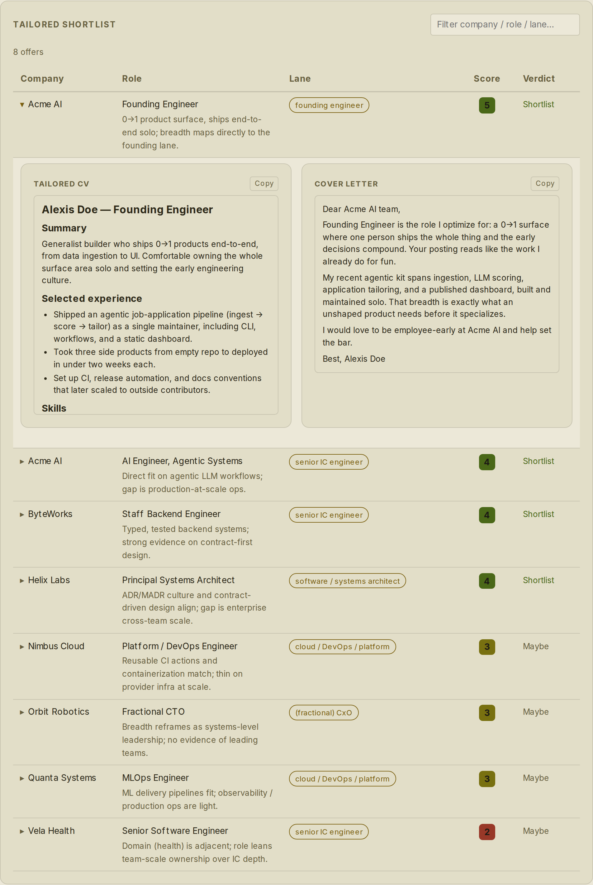
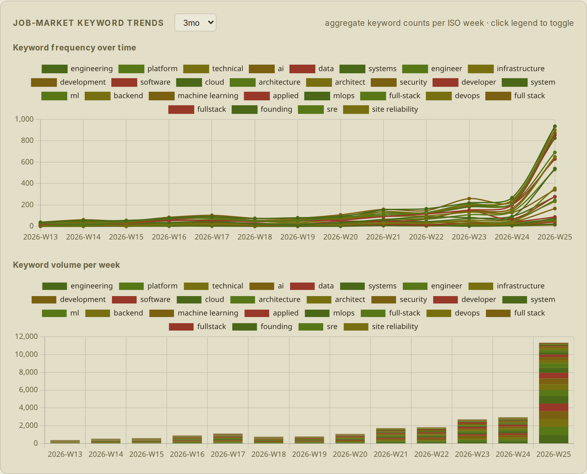

# agentic-job-offer-to-application-kit

> Turn a candidate portfolio into tailored, ATS-safe job applications — feed/API-first, no
> scraping, no automated submission.

[](LICENSE)
[](CHANGELOG.md)
[](https://github.com/qte77/agentic-job-offer-to-application-kit/actions/workflows/codeql.yaml)
[](https://www.codefactor.io/repository/github/qte77/agentic-job-offer-to-application-kit)
[](https://github.com/qte77/agentic-job-offer-to-application-kit/actions/workflows/ci.yaml)
[](https://github.com/qte77/agentic-job-offer-to-application-kit/actions/workflows/lint-md-links.yml)

## What

A **generic** pipeline (a small Python engine + LLM/agent phases). **Claude Code** is the
on-demand orchestrator via Workflow-tool scripts, but the phases are documented
agent-agnostically so any coding agent can drive them.

1. **Evidence library** (build once) — mine a portfolio into a verified, lane-tagged brag document.
2. **Ingest → relevance** (per search) — pull job descriptions (JDs) from public applicant
   tracking systems (ATS) + feeds, **pre-filter** cheaply, then LLM-screen against your lanes → a scored shortlist.
3. **Tailor** (per offer) — match → CV + cover letter + gap report, with an `ats-check` parse-safety
   pass, writing-style/tone matching, and a human-review prefill pack (see docs/research.md §Delivery).

Five configurable **position lanes** (CxO/fractional · founding engineer · senior IC engineering ·
cloud/DevOps/platform · architect) — see
[docs/architecture.md §Position lanes](docs/architecture.md#position-lanes). Cost model: cheap
pre-filter → LLM relevance → tailor only the shortlist.

<details>
<summary>Screenshot — shortlist (first offer expanded to its tailored CV + cover letter)</summary>

<br />

<picture>
  <source media="(prefers-color-scheme: dark)" srcset="assets/images/dashboard-shortlist-dark.png" />
  
</picture>

</details>

<details>
<summary>Screenshot — market keyword trends (default 3-month window)</summary>

<br />

<picture>
  <source media="(prefers-color-scheme: dark)" srcset="assets/images/dashboard-market-dark.png" />
  
</picture>

</details>

## How

Try the **[live demo](https://qte77.github.io/agentic-job-offer-to-application-kit/)** (synthetic
shortlist · live market trends, bundled same-origin from the `data` branch at deploy), or run it
locally. **Prerequisite:** [uv](https://docs.astral.sh/uv/) (it provisions Python ≥ 3.11):

```bash
git clone https://github.com/qte77/agentic-job-offer-to-application-kit
cd agentic-job-offer-to-application-kit
make install-uv   # install uv (skip if already installed)
make install      # sync the dev environment (uv)
make preview      # serve the dashboard at http://localhost:8000 (PORT=9000 make preview to change)
```

Two ways to actually use it once installed — both run the LLM phases via the **Claude Code**
Workflow tool (`Workflow({…})`), so you'll need Claude Code installed as well as uv:

- **Try the bundled example (no fetch, no data of your own).** Screen the synthetic
  [`examples/alexis-doe/`](examples/alexis-doe/) corpus straight to a scored shortlist plus a tailored
  CV and cover letter — it ships a pre-built evidence library, so no `make ingest` / `make chunk`:

  ```text
  Workflow({ scriptPath: ".claude/workflows/cc-workflow-relevance.js",
             args: { rootDir: "examples/alexis-doe", batchCount: 1 } })
  ```

- **Run your own search.** Author your sources in `config/seed.json` and build your evidence library,
  then run the pipeline against real, public, no-auth JDs: ingest → chunk → relevance → tailor →
  ats-check. For recurring runs, `ajoa-kit ingest --merge` folds each pull into a running
  `results/corpus.json` (the scheduled `ingest-daily.yaml` cron) so keyword trends accrue over time.

End-users: **[docs/quickstart.md](docs/quickstart.md)** narrates the full run end-to-end (prerequisites
plus the keyword-trends and writing-style options). Contributors: **[CONTRIBUTING.md](CONTRIBUTING.md)**
is the dev/release command reference (the Makefile is the source of truth).

**Constraints:** no automated submission, no scraping — public no-auth GET only, with a
human-reviewed prefill pack (see [docs/research.md §Delivery](docs/research.md#delivery)); no PII in
the repo (see [docs/architecture.md §Data layout](docs/architecture.md#data-layout)).

## Why

Job search is noisy: hundreds of postings, each needing a tailored CV and cover letter with an
honest framing of gaps. This kit aligns one portfolio to many offers — screen for fit, then
tailor — using only public, no-auth data and keeping a human in the loop for submission.

## Refs

- [docs/architecture.md](docs/architecture.md) — pipeline, components, execution model
- [docs/quickstart.md](docs/quickstart.md) — full run workflow + optional features
- [docs/roadmap.md](docs/roadmap.md) — what's built, what's next, what's deferred
- [docs/userstory.md](docs/userstory.md) — user stories with acceptance criteria
- [docs/research.md](docs/research.md) — fetching, ATS, and positioning research
- Decisions (ADRs): [ADR-0001 layering](docs/decisions/0001-backend-cli-ui-separation.md) · [ADR-0002 source ToS tiers](docs/decisions/0002-source-tos-tiers.md) · [ADR-0003 data contracts](docs/decisions/0003-data-contract-enforcement.md)
- [examples/alexis-doe/](examples/alexis-doe/) — synthetic end-to-end example
- [CONTRIBUTING.md](CONTRIBUTING.md) — command reference (run/dev/release), setup, testing, and PRs
- [AGENTS.md](AGENTS.md) — operating rules for AI coding agents
- [SECURITY.md](SECURITY.md) — vulnerability disclosure policy

## License

Apache-2.0 © 2026 qte77. See [LICENSE](LICENSE) and [NOTICE](NOTICE) (third-party components — vendored Chart.js + marked, MIT).
