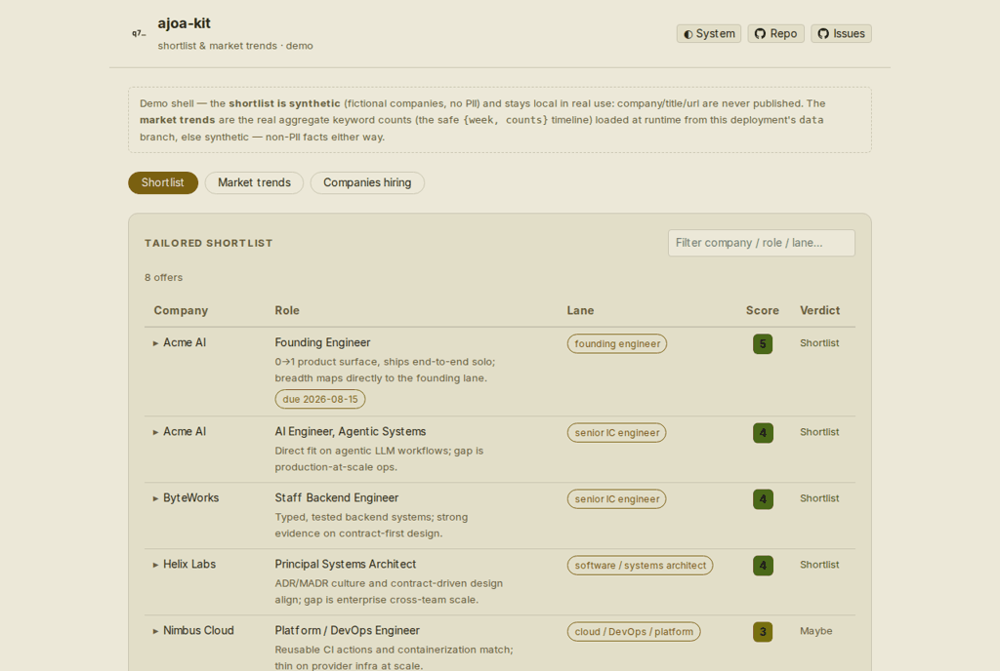

# agentic-job-offer-to-application-kit

> Turn a candidate portfolio into tailored, ATS-safe job applications — grounded in evidence you
> actually have, with a gap report for what you don't. Feed/API-first, no invented experience, no
> scraping, no automated submission.

[](LICENSE)
[](CHANGELOG.md)
[](pyproject.toml)
[](pyproject.toml)
[](https://github.com/qte77/agentic-job-offer-to-application-kit/actions/workflows/codeql.yaml)
[](https://www.codefactor.io/repository/github/qte77/agentic-job-offer-to-application-kit)
[](https://github.com/qte77/agentic-job-offer-to-application-kit/actions/workflows/ci.yaml)
[](https://github.com/qte77/agentic-job-offer-to-application-kit/actions/workflows/lint-md-links.yml)

## What

It tailors only to evidenced claims — no invented experience, no keyword-stuffing — and reports the
gaps it can't cover, so you see where you actually stand before applying.

Under the hood it's a **generic** pipeline (a small Python engine + LLM/agent phases). **Claude Code**
is the on-demand orchestrator via Workflow-tool scripts, but the phases are documented
agent-agnostically so any coding agent can drive them.

1. **Evidence library** (build once) — mine a portfolio into a verified, lane-tagged brag document.
2. **Ingest → relevance** (per search) — pull job descriptions (JDs) from public applicant
   tracking systems (ATS) + feeds, **pre-filter** cheaply, then LLM-screen against your lanes → a scored shortlist.
3. **Tailor** (per offer) — match → CV + cover letter + gap report, with an `ats-check` parse-safety
   pass, writing-style/tone matching, and a human-review prefill pack (see docs/research.md §Delivery).

Seven configurable **position lanes** (CxO/fractional · founding engineer · senior IC engineering ·
applied-AI/ML · forward-deployed/solutions · cloud/DevOps/platform · architect), defined in
`config/lanes.json` — see [docs/architecture.md §Position lanes](docs/architecture.md#position-lanes).

Optionally add `config/location.json` to have the screen flag location and work-authorization
constraints — `{basedIn, authorizedIn[], remoteOk, relocateTo[], notes}`, emitted with
`ajoa-kit location --json` and passed as the workflow's `args.location`. It is **advisory**: a
flagged posting keeps its score and stays on the shortlist, with the constraint quoted in
`deal_breaker`. The file is git-ignored on purpose (it describes you, not the project), so create
it locally; without it the screen ignores location entirely.

Optionally add `config/tenure.json` to have the screen flag a JD's stated tenure requirement
against your own longest single-employer tenure — `{longestTenureYears, notes}`, emitted with
`ajoa-kit tenure --json` and passed as the workflow's `args.tenure`. Same shape as location: it is
**advisory** (a flagged posting keeps its score, with the constraint quoted in `deal_breaker`) and
inert without a `longestTenureYears` above zero. Also git-ignored.

Optionally add `config/manual-jds.json` for postings no adapter can reach — a role published only
behind a JS accordion, a login, or a page with no feed. Each entry is
`{id, title, company, companySlug, location, url, description, laneHint, postedAt, remote}`, and
`ingest` injects them into every pull, so they survive the wholesale rewrite of
`results/jobs-raw.json` and are never delisted from the corpus. Removing an entry is how you retire
one; if a board later publishes the same id, the pulled record wins. Also git-ignored (captured JD
text is not project content).

Cost model: cheap pre-filter → LLM relevance → tailor only the shortlist
(measured: ≈100k tokens per 40-JD relevance batch; ≈300–600k per tailored offer with the
critique pass).

A no-build **dashboard** (screencast below) surfaces the tailored shortlist, the published job-market
trends (keyword frequency + geo-by-field hiring), and a local Companies-hiring view with a snapshot
date and click-to-sort columns.

<details>
<summary>Screencast — the dashboard end to end: shortlist (an offer expanded to its tailored CV + cover letter), market keyword trends + geo-by-field hiring, and the Companies tab (snapshot date + click-to-sort columns)</summary>

<br />

<picture>
  <source media="(prefers-color-scheme: dark)" srcset="assets/images/usage-dark.gif" />
  
</picture>

</details>

## Why

Job search is noisy: hundreds of postings, each needing a tailored CV and cover letter with an
honest framing of gaps. This kit aligns one portfolio to many offers — screen for fit, then
tailor — using only public, no-auth data and keeping a human in the loop for submission.

## How

Try the **[live demo](https://qte77.github.io/agentic-job-offer-to-application-kit/)** (synthetic
shortlist · live market trends, bundled same-origin from the `data` branch at deploy), or run it
locally. **Prerequisite:** [uv](https://docs.astral.sh/uv/) (it provisions Python ≥ 3.11):

```bash
git clone https://github.com/qte77/agentic-job-offer-to-application-kit
cd agentic-job-offer-to-application-kit
make install_uv   # install uv (skip if already installed)
make install      # sync the dev environment (uv)
make preview      # serve the dashboard at http://localhost:8000 (PORT=9000 make preview to change)
```

The demo and dashboard are fully standalone; **running a search is agent-driven** — the
relevance/tailor phases execute only inside a Claude Code session (documented
agent-agnostically, so another coding agent can implement them). Two ways to actually use it
once installed — both run the LLM phases via the **Claude Code** Workflow tool
(`Workflow({…})`), so you'll need Claude Code installed as well as uv:

- **Try the bundled example (no fetch, no data of your own).** Screen the synthetic
  [`examples/alexis-doe/`](examples/alexis-doe/) corpus straight to a scored shortlist plus a tailored
  CV and cover letter — it ships a pre-built evidence library, so no `make ingest` / `make chunk`:

  ```text
  Workflow({ scriptPath: ".claude/workflows/cc-workflow-relevance.js",
             args: { rootDir: "examples/alexis-doe", batchCount: 1 } })
  ```

- **Run your own search.** Author your sources in `config/seed.json` and build your evidence library,
  then run the pipeline against real, public, no-auth JDs: ingest → chunk → relevance → tailor →
  ats-check. For recurring runs, `ajoa-kit ingest --merge` folds each pull into a running
  `results/corpus.json` (the scheduled `ingest-daily.yaml` cron) so the keyword and geo-by-field
  company-hiring trends accrue over time;
  `ajoa-kit chunk --new` → `persist --merge` re-screens only the newly-seen offers into your shortlist,
  and `ajoa-kit refresh` flags filled/closed offers (or removes them with `--delete`);
  `ajoa-kit verify-sources` re-probes the seed and re-stamps `_date_verified` on the sources still live.
  To guarantee coverage rather than tailor one offer at a time by hand, `ajoa-kit pack-plan
  --min-score 5 --json` writes `results/pack-plan.json` — every shortlist row a
  [`config/pack-policy.json`](docs/decisions/0005-pack-coverage-policy.md) policy selects
  (`--min-score`/`--max-packs`/`--lanes` override it per run) that has no pack yet; loop tailor +
  `persist-offer` over that list, then re-run `pack-plan` until it reports `missing: []`.
  Optionally, `ajoa-kit discover-yc` follows the yc-oss hiring feed into public YC company JDs
  (`results/yc-jobs.json`), and `ajoa-kit discover-slugs --location/--job-title/--company-name` mines
  startups.gallery for new first-party ATS slugs (`results/emerging-slugs.json`) to review before adding
  to your seed — both read-only public GET, CAUTION-tier ([ADR-0004](docs/decisions/0004-discovery-source-tiers.md)), local-only.
  `ajoa-kit open-offers --min-score 5` opens every selected shortlist offer's application URL in
  your own browser tab (plain `webbrowser.open`, no automation on the target site) so you don't
  have to hunt each one down by hand before applying.

End-users: **[docs/quickstart.md](docs/quickstart.md)** narrates the full run end-to-end (prerequisites
plus the keyword-trends and writing-style options). Contributors: **[CONTRIBUTING.md](CONTRIBUTING.md)**
is the dev/release command reference (the Makefile is the source of truth).

**Constraints:** no automated submission, no scraping — public no-auth GET only, with a
human-reviewed prefill pack (see [docs/research.md §Delivery](docs/research.md#delivery)); no PII in
the repo (see [docs/architecture.md §Data layout](docs/architecture.md#data-layout)).

## Refs

- [docs/architecture.md](docs/architecture.md) — pipeline, components, execution model
- [docs/quickstart.md](docs/quickstart.md) — full run workflow + optional features
- [docs/roadmap.md](docs/roadmap.md) — what's built, what's next, what's deferred
- [docs/userstory.md](docs/userstory.md) — user stories with acceptance criteria
- [docs/research.md](docs/research.md) — fetching, ATS, and positioning research
- Decisions (ADRs): [ADR-0001 layering](docs/decisions/0001-backend-cli-ui-separation.md) · [ADR-0002 source ToS tiers](docs/decisions/0002-source-tos-tiers.md) · [ADR-0003 data contracts](docs/decisions/0003-data-contract-enforcement.md) · [ADR-0004 discovery source tiers](docs/decisions/0004-discovery-source-tiers.md)
- [examples/alexis-doe/](examples/alexis-doe/) — synthetic end-to-end example
- [CONTRIBUTING.md](CONTRIBUTING.md) — command reference (run/dev/release), setup, testing, and PRs
- [AGENTS.md](AGENTS.md) — operating rules for AI coding agents
- [SECURITY.md](SECURITY.md) — vulnerability disclosure policy

## License

Apache-2.0 © 2026 qte77. See [LICENSE](LICENSE) and [NOTICE](NOTICE) (third-party components — vendored Chart.js + marked, MIT).
