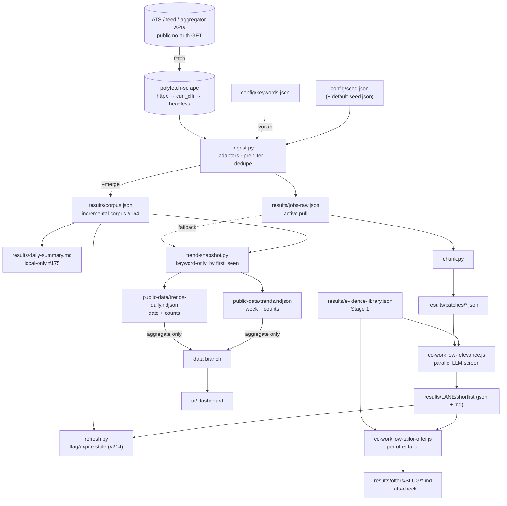
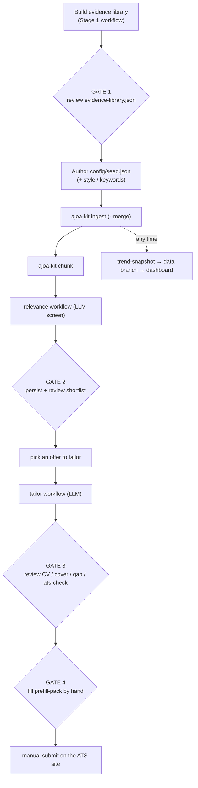

# Architecture — agentic-job-offer-to-application-kit

A generic pipeline (config → Python engine → results) with LLM/agent phases. Claude Code is the
on-demand orchestrator (Workflow-tool scripts), but the phases are described agent-agnostically so
other coding agents can drive them.

The repo follows a four-layer separation — backend / CLI / orchestration / UI, one-way imports
only — per [ADR-0001](decisions/0001-backend-cli-ui-separation.md). Ingest source ToS/ToU tiers are
governed by [ADR-0002](decisions/0002-source-tos-tiers.md).

## Pipeline



Everything under `results/` stays private (git-ignored locally; a private GHA artifact across runs) —
it is now **exclusively PII**. The keyword-only `week + counts` trends are written to `public-data/`
(PII-free) and are the only data that crosses to the public `data` branch — see
[Systems & data boundaries](#systems--data-boundaries).

Run-once upstream: `cc-workflow-evidence-library.js` → `results/evidence-library.json`.

Side branch (any time after ingest): `ajoa-kit trend-snapshot` reads `results/corpus.json` when present
(bucketing by each JD's `first_seen`), else falls back to `results/jobs-raw.json` (`posted_at`) →
aggregate keyword-only `public-data/trends.ndjson` (per ISO week) **and** `public-data/trends-daily.ndjson` (per
day). Weekly is **rolled up from the daily buckets** (`weekly_from_daily`), so the two series can't
disagree; counts are the config-driven vocabulary — no JD content.

> **Trend-history caveat (#191).** Buckets are keyed by `first_seen` (when we first saw a JD), stored
> only in the running `results/corpus.json` — a time-limited GHA artifact. The **first** run stamps
> every JD with the run date: an inherent one-off **seed spike** (2026-06-27) that dwarfs daily inflow.
> Not every jump is an artifact, though — a large rise can be **genuine** new inflow (2026-07-01 was
> ~1.6k real new postings, verified absent from the 06-30 corpus), and a failed-cron day leaves a gap
> (2026-07-04). The real hazard is a cron lapse past the artifact retention re-stamping every JD (a
> **silent reset**); the cron now fails loud rather than reseeding (#270), and a durable corpus store
> is the fuller fix (#191). These effects are baked in — the true first-seen history can't be
> reconstructed from the aggregate series.

**Two-stage trim (cost model):** cheap deterministic pre-filter → LLM relevance screen →
expensive tailoring only on the shortlist.

## User flow



The pipeline is **human-gated at four points** and ends in a manual submission — no automation crosses
into actually applying (see [research.md §Delivery](research.md#delivery)).

## Three mechanics that define it

1. **Orchestration = Claude Code Workflow tool, not make/node.** Workflows run via
   `Workflow({ scriptPath: '.claude/workflows/cc-workflow-*.js', args })`, resumable and cached by run
   id; subagents are inline `agent()` calls — no `.claude/agents/*.md`, no team mode. The `.js`
   scripts are the reference implementation; the phases are documented agent-agnostically.
2. **The evidence library is structured data.** `cc-workflow-evidence-library.js` returns the `LIB`
   object (skill clusters, master CV bullets, per-lane angles, gaps) written to
   `results/evidence-library.json` — the retrieval source of truth the relevance and tailor steps read.
3. **A web-access layer wraps polyfetch.** `src/ajoa_kit/sources.py` fetches via `polyfetch-scrape`
   (httpx → curl_cffi → headless), invoked with `uv run --directory $POLYFETCH_DIR` — never vendored.
   Feed/API-first, no-auth, GET only; each record carries `fetched_backend` for tier monitoring.

## Data contracts

What crosses each boundary, and whether it is validated. Only a handful are pydantic today (see
**Typed today** below); the L3 workflows validate `agent()` outputs with inline JSON Schema, but that guarantee
is **lost when Python reads the result file back**. The future direction — pydantic parse-on-read at
every cross-layer boundary — is [ADR-0003](decisions/0003-data-contract-enforcement.md) (designed, not
built).

| Contract | Defined at | Typed? | Producer → consumer | Artifact |
|---|---|---|---|---|
| JD record | `normalize.record()` | dict — untyped | adapters → corpus / chunk / trends | `results/jobs-raw.json` |
| Corpus record | `corpus.merge_corpus` | dict + `first_seen` / `last_seen` / `last_changed` / `content_hash` | ingest `--merge` → trends / chunk / next run | `results/corpus.json` |
| Daily digest | `corpus.summarize_changes` + `render_daily_summary` | dict → markdown | ingest `--merge` → human | `results/daily-summary.md` (local-only) |
| Trends week | `models.WeekCounts` | **pydantic** (write-side) | trend-snapshot → dashboard | `public-data/trends.ndjson` |
| Trends day | `models.DayCounts` | **pydantic** (write-side) | trend-snapshot → dashboard (#187) | `public-data/trends-daily.ndjson` |
| Trends month | `models.MonthCounts` | **pydantic** (write-side) | trend-snapshot → dashboard (#188) | `public-data/trends-monthly.ndjson` |
| Batches + manifest | `chunk.main` | dict — untyped | chunk → relevance | `results/batches/*.json` |
| Shortlist | relevance.js schema / `persist_scored` / `refresh` | JSON-Schema (JS) → **pydantic** `ScoredItem` parse-on-read (persist + merge/refresh re-reads) + `stale`/`last_checked` (#214) + `deadline`/`deal_breaker` (#271) | relevance → persist → refresh → dashboard | `results/LANE/shortlist.json` / `.md` |
| Offer pack | tailor.js schema / `persist_offer` | JSON-Schema (JS) → dict (Py) | tailor → persist | `results/offers/SLUG/*.md` |
| `must_haves` | tailor.js / `coverage.py` | JSON-Schema (JS) → dict (Py) | tailor → coverage | `coverage-report.md` |
| Evidence library `LIB` | `cc-workflow-evidence-library.js` | JSON-Schema (JS) | Stage 1 → relevance / tailor | `results/evidence-library.json` |
| App settings | `settings.AppSettings` | **pydantic-settings** | every entry point | — (env / cwd) |
| Position lanes | `ingest.load_lanes` / `models.Lane` | **pydantic** | human → relevance / evidence (`cfg.lanes`) | `config/lanes.json` |
| seed / keywords / style | `sources.load_sources` / `ingest.load_keywords`, `models.StyleBrief` | untyped / **pydantic** | human → ingest / tailor | `config/*.json` |

**Typed today:** `AppSettings`, `WeekCounts` (write), `Lane` (config), `StyleBrief` (tailor), and the
shortlist items (`ScoredItem`, parse-on-read through persist + merge/refresh, #271). **JS-schema'd at the `agent()`
boundary but untyped on Python re-read:** offer pack, `must_haves`, evidence library.
**Untyped:** the JD/corpus records (the highest-volume boundary), batches, and the remaining config
files. ADR-0003 ranks the hardening: `JobRecord` → `ScoredResult` envelope → shared
`must_haves` model → config-entry models. The single `config/lanes.json` lane source shipped (#195 —
pydantic `Lane` + `load_lanes`), the `persist_scored` lane-membership check against it ships too
(a hallucinated `best_lane` is blanked to `unsorted/`), and the shortlist items are now typed
`ScoredItem` end-to-end (#271); `JobRecord` typing remains the next ADR-0003 item.

## Patterns

- **Pure core, injected `today`** — `corpus.merge_corpus` / `summarize_changes` take the date as an
  argument (the caller passes `date.today()`), so L1 is deterministic and testable; no `datetime.now()`.
- **Lazy `polyfetch_scrape` import** — `sources.get_json` / `get_bytes` import the fetch stack *inside*
  the function, so the pure logic (and its tests) import offline.
- **Warn-and-continue** — `ingest.collect` wraps each source pull; one bad source lands in `failures`
  and never aborts the run.
- **Dispatch tables** — `sources.ATS` / `sources.AGGREGATORS` map a source-type string to its adapter;
  `load_sources` drives them from the seed.
- **Config-SSOT vocabulary** — the tracked `config/keywords.json` is canonical;
  `ingest.load_keywords` falls back to the in-code mirror in `defaults.py` (a drift-guard test keeps
  file and mirror equal); `trend_snapshot` reuses it. `ingest.load_lanes` follows the same shape
  (`config/lanes.json` → `defaults.DEFAULT_LANES`).
- **Upsert-by-key** — `corpus.merge_corpus` (by JD `id`, four states) and `trend_snapshot.upsert_week`
  (by ISO week) replace in place while preserving the rest.
- **Record factory** — `normalize.record()` is the single fixed-shape dict every adapter emits
  (`canonical_url` applied at construction).
- **Run-scoped artifacts** — `results/` is git-ignored and handed between steps (and across CI runs) as
  a private GHA artifact, never inlined into the orchestrator.
- **Defensive `args` parse** — each L3 workflow script `JSON.parse`s `args` when the Workflow tool
  passes it as a string.
- **Pydantic for published / config contracts** — `WeekCounts` (keeps JD content out of the trends feed
  by construction) and `AppSettings`.

## Systems & data boundaries

**External systems:** `polyfetch-scrape` (the fetch stack, borrowed via `uv run --directory`, never
vendored); public no-auth ATS / feed / aggregator endpoints (read-only GET); GitHub Actions (CI + the
daily `ingest-daily` cron); the orphan `data` branch; gh-pages (the dashboard).

**Data / PII boundary** (paths in [Data layout](#data-layout)):

- `config/` and `results/` are git-ignored — your inputs and every generated artifact stay off `main`.
- The corpus crosses runs only as a **private GHA artifact**; the local-only `daily-summary.md` (#175)
  names companies/titles and is never uploaded or pushed.
- `results/` is **exclusively PII**; the publishable keyword-only `week + counts` trends live in a
  separate git-ignored, PII-free **`public-data/`** dir (#210). Only those reach the **`data` branch**
  — `make trends-data` builds the tree from `public-data/` and a **tree-allowlist guard** aborts the
  push unless it contains only `public-data/trends{,-daily}.ndjson`, so nothing else can ride along.
- **No automated submission** — the pipeline ends at a human-reviewed prefill pack; there is no
  auto-submit path.

## Position lanes

Seven configurable lanes scored by the relevance screen: `cxo`, `founding`, `engineering`, `ml`
(applied AI / LLM apps / agentic), `fde` (forward-deployed / solutions), `cloud`, `architect`. The
canonical set (each with a focus and an honest gap note) lives in **`config/lanes.json`** — the
cross-runtime single source of truth (#195). Python loads it via `ingest.load_lanes()` (pydantic
`Lane`); `ajoa-kit lanes --json` emits the payload to pass the relevance/evidence workflows as
`cfg.lanes`, so one file feeds both runtimes. The two JS scripts keep an in-code `LANES` array only as
a no-config fallback that mirrors the file (`cc-workflow-relevance.js` derives just the keys).
`cfg.lanes` remains the runtime SSOT, written into the evidence library.

**Re-bucket rule.** Each JD is assigned exactly one `best_lane`, so adding or removing a lane requires
a **full relevance re-run** to re-bucket — there is no correct "incrementally score only the new lane"
(an existing `engineering` JD could legitimately become `ml`). `ajoa-kit refresh` (#214) is the
complement: it keeps a lane's *existing* shortlist current (flags/expires filled-or-closed offers via
the corpus `delisted` state + a read-only URL re-probe) but never re-buckets.

The incremental screen `ajoa-kit chunk --new` → relevance → `persist --merge` (#226) is the *inbound*
complement: `chunk --new` batches offers new or changed in the latest pull
(`last_changed == max(last_seen)` in the corpus, #235) and `persist --merge` unions them by id into the
existing shortlists — new offers into current lanes, never a re-bucket. If a `--merge` re-screen does
reassign an offer's `best_lane`, `persist` evicts it from the old lane bucket so it never
double-buckets (#236).

## Repo structure

```text
agentic-job-offer-to-application-kit/
├── README.md / AGENTS.md / CHANGELOG.md / SECURITY.md / LICENSE
├── docs/
│   └── architecture.md / roadmap.md / userstory.md / research.md
├── src/ajoa_kit/               # engine: ingest, corpus, chunk, persist_scored, persist_offer, ats_check,
│                               #   style, prefill, slug_probe, refresh, settings, __main__ (CLI)
├── scripts/ingest.sh           # thin env shim -> ajoa-kit ingest (borrows polyfetch's uv env via POLYFETCH_DIR)
├── config/                     # your inputs — git-ignored except the tracked default-seed.json
│                               #   default-seed.json (shipped sources) · your seed.json overrides it
├── tests/                      # value-add suite (pre-filter, canonical_url, dedup, adapters)
├── examples/alexis-doe/        # self-contained example mirroring config/ + results/ (committed)
├── results/                    # generated outputs (PII) — git-ignored, dir kept via .gitkeep
│                               #   evidence-library.json, jobs-raw.json, corpus.json, batches/, <lane>/shortlist.*, offers/<slug>/ (pack .md + meta.json #209)
├── public-data/                # PII-free publishable aggregates (trends) — git-ignored; the only data published (#210)
├── pyproject.toml / uv.lock    # uv project; ruff + pyright + complexipy + pytest + scriv config
├── .claude/
│   └── workflows/
│       ├── cc-workflow-evidence-library.js   # Stage 1 (built)
│       ├── cc-workflow-relevance.js          # Stage 2 screen (built)
│       └── cc-workflow-tailor-offer.js       # Stage 3 tailor (built)
└── .github/                    # codeql + dependabot + ci + lint-md-links + issue-triage + ingest-daily + CODEOWNERS (SHA-pinned)
```

## Data layout

The authoritative list of git-ignored, never-committed paths (so no PII is ever committed) — the
single source of truth that AGENTS.md, README.md, and SECURITY.md link to:

- `config/` — inputs you author (`seed.json`, optional `style.json`); git-ignored
  **except** the tracked, PII-free `config/default-seed.json` (the shipped, ToS-vetted default
  source list of public board slugs; tiers per [ADR-0002](decisions/0002-source-tos-tiers.md)),
  the tracked `config/keywords.json` (the canonical pre-filter vocabulary — generic terms only,
  they become the published trend keys) and
  `config/lanes.json` (the canonical position lanes, #195). Your `config/seed.json` overrides the
  default-seed when present; absent it, ingest falls back to the default.
- `results/` — everything generated and **PII-bearing** (`jobs-raw.json`, `corpus.json`,
  `daily-summary.md`, `<lane>/shortlist.*`, `offers/<slug>/`); git-ignored (dir kept via `.gitkeep`),
  **never published**. The `daily-summary.md` digest (#175) names companies/titles → **local-only**,
  never a CI artifact or branch.
- `public-data/` — the **PII-free** publishable aggregates only (`trends.ndjson` / `trends-daily.ndjson`,
  keyword `{week,counts}`); git-ignored, generated (#210). The one place anything crosses to the `data`
  branch (via `git add -f`, guarded by `make trends-data`'s tree allowlist).
- `library/`, `input/` — additional generated/working directories; git-ignored.
- `examples/alexis-doe/` — a committed, self-contained example mirroring `config/` + `results/`.

## Boundary failure policy

| Boundary | Policy |
|---|---|
| ATS/feed fetch (per source) | wrap-continue (one source down ≠ run fails) |
| JD parse (per record) | wrap-continue (skip malformed) — typing planned in [ADR-0003](decisions/0003-data-contract-enforcement.md) |
| config load (seed) | fail-loud (missing/invalid config stops the run) |
| evidence-library load (relevance) | fail-loud (clear "run Stage 1 first") |
| shortlist liveness probe (`refresh`, #214) | wrap-continue; an inconclusive probe (network error/timeout) keeps the entry — never expire on a flaky network |

## Built vs designed

- **Built:** `src/ajoa_kit/` engine; `AppSettings` config + `ajoa-kit` CLI (ADR-0001 L1/L2);
  `cc-workflow-evidence-library.js`; `cc-workflow-relevance.js`; `cc-workflow-tailor-offer.js` Stage-3
  tailor pack (match/CV/cover-letter/gap-report/prefill-pack + optional coverage-report on JD
  must-have coverage, #55); `ajoa-kit ats-check` parse-safety (#9);
  style/tone tailoring (#16); `ajoa-kit status` local application-outcome tracker (#273);
  cited delivery safety note (research.md §Delivery, #8); structured board
  catalog (#10) with ToS/ToU tiers (ADR-0002, #95); runtime-configurable pre-filter keywords (`config/keywords.json`, #31);
  `ajoa-kit trend-snapshot` → keyword-only `public-data/trends.ndjson` (#11 PR-A) rendered by the two-tab
  no-build `ui/` dashboard (#11 PR-B, vendored Chart.js — synthetic Tab A + aggregate `{week,counts}`
  Tab B); the reusable `run-with-keywords` workflow (#79); `ajoa-kit refresh` shortlist liveness sweep
  (#214 — corpus-delisted + URL re-probe, flag-`stale`-or-`--delete`); baseline gates (ruff, pyright,
  complexipy, pytest, CodeQL/Dependabot/CI, markdownlint+lychee).
- **Built (dashboard UX + CI):** trends bundled **same-origin** at deploy (the ingest cron dispatches
  a redeploy after each `data` push — no cross-origin fetch); expandable shortlist rows → tailored CV + cover
  letter; **`make preview` shows your real local shortlist** (#209 — aggregated from
  `results/<lane>/shortlist.json`, same-origin, never published); a market-trends time-frame picker;
  Repo/Issues header links; `make preview` serves a throwaway copy keeping real data out of the source `ui/`; AI issue-triage CI (`issue-triage.yaml`,
  SHA-pinned, GitHub Models, zero-secret).
- **Designed:** #71 Vite intentionally not adopted (no-build).
- **Dropped (YAGNI):** team mode, dual modes, validation ceremony, slide decks, locale-aware document conventions (#12, not planned); a multi-column
  dashboard rework + AG-UI/A2UI generative-UI (the no-build `ui/` renders fixed data — shortlist +
  trends — so agent-emitted dynamic UI isn't needed; multi-column is a trivial CSS-Grid change if ever
  wanted, no framework).
